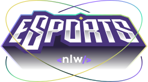

<a name="readme-top"></a>

<!-- PROJECT LOGO -->
<br />
<div align="center">

  <a href="https://github.com/DarkMetaK/Nlw-Esports">
    
  </a>

  <h3 align="center">NLW E-Sports</h3>

  <p align="center">
    Desenvolvimento de uma REST API, com sistema web e mobile, criados durante a Next Level Week
  </p>
</div>


<!-- TABLE OF CONTENTS -->
<details>
  <summary>Sumário</summary>
  <ol>
    <li>
      <a href="#sobre">Sobre</a>
      <ul>
        <li><a href="#tecnologias">Tecnologias</a></li>
      </ul>
    </li>
    <li>
      <a href="#como-rodar-o-projeto">Como rodar o projeto</a>
    </li>
    <li><a href="#melhorias">Melhorias</a></li>
    <li><a href="#contato">Contato</a></li>
    <li><a href="#agradecimentos">Agradecimentos</a></li>
  </ol>
</details>


<!-- ABOUT THE PROJECT -->
## Sobre

<a href="https://github.com/DarkMetaK/Nlw-Esports">
    
</a>

A plataforma desenvolvida tem como objetivo facilitar a busca por 'duos' para os jogos mais populares da Twitch. Os usuários podem criar anúncios na plataforma, e realizar a comunicação através do Discord fornecido. Toda estrutura segue o modelo REST API, onde o back-end retorna respostas em JSON que são processadas de formas diferentes no ambiente Web e Mobile.

### Tecnologias

* Back-end:<br>
[![Node][Node.js]][Node-url]<br>
[![TypeScript][TypeScript.js]][TypeScript-url]<br>
[![SQLite][SQLite]][SQLite-url]<br>
[![Prisma][Prisma]][Prisma-url]<br>

* Web:<br>
[![React][React.js]][React-url]<br>
[![TypeScript][TypeScript.js]][TypeScript-url]<br>
[![Tailwind][Tailwind]][Tailwind-url]<br>

* Mobile:<br>
[![ReactNative][ReactNative]][ReactNative-url]<br>
[![TypeScript][TypeScript.js]][TypeScript-url]<br>
[![Expo][Expo]][Expo-url]<br>


<p align="right">(<a href="#readme-top">Retornar ao topo</a>)</p>

<!-- GETTING STARTED -->
## Como rodar o projeto

É possível acessar o front-end estático do site pelo link: https://darkmetak-dio.netlify.app/
<br><strong>Obs:</strong> Como é necessário realizar o login para acessar a rota do feed, não é possível visualizá-la na hospedagem em questão<br>

1 - Clone o repositório
```sh
git clone https://github.com/DarkMetaK/Nlw-Esports.git
```

2 - Acesse a pasta server/web/mobile e instale as dependências
```sh
npm install
```

3 - Execute o projeto<br><br>
3.1 - Server:
```sh
npm run dev
```
3.2 - Web:
```sh
npm run dev
```
3.3 - Mobile:
```sh
npx expo start
```

<p align="right">(<a href="#readme-top">Retornar ao topo</a>)</p>

## Melhorias

- [x] Adicionar Responsividade
- [x] Adicionar slide
- [ ] Permitir adição de anúncios no mobile
- [ ] Permitir visualização de anúncios no web
- [ ] Consumir dados do Discord

<p align="right">(<a href="#readme-top">Retornar ao topo</a>)</p>

<!-- CONTACT -->
## Contato

Matheus Porto - [LinkedIn](https://www.linkedin.com/in/matheusport0/) - matporto03@gmail.com

Link Repositório: [https://github.com/DarkMetaK/Nlw-Esports](https://github.com/DarkMetaK/Nlw-Esports)

<p align="right">(<a href="#readme-top">Retornar ao topo</a>)</p>

<!-- ACKNOWLEDGMENTS -->
## Agradecimentos

* [Best-README-Template](https://github.com/othneildrew/Best-README-Template)
* [Img Shields](https://shields.io)
* [Markdown Badges](https://github.com/Ileriayo/markdown-badges)
* [React Icons](https://react-icons.github.io/react-icons/search)
* [Tailwind CSS](https://tailwindcss.com/)
* [React Hook Form](https://react-hook-form.com/)
* [React Router](https://reactrouter.com/en/main)
* [Keen Slider](https://keen-slider.io/)

<p align="right">(<a href="#readme-top">Retornar ao topo</a>)</p>

<!-- MARKDOWN LINKS & IMAGES -->
[Node.js]: https://img.shields.io/badge/Node.js-43853D?style=for-the-badge&logo=node.js&logoColor=white
[Node-url]: https://nodejs.org/en/
[SQLite]: https://img.shields.io/badge/SQLite-07405E?style=for-the-badge&logo=sqlite&logoColor=white
[SQLIte-url]: https://www.sqlite.org/index.html
[Prisma]: https://img.shields.io/badge/Prisma-3982CE?style=for-the-badge&logo=Prisma&logoColor=white
[Prisma-url]: https://www.prisma.io/
[React.js]: https://img.shields.io/badge/React-20232A?style=for-the-badge&logo=react&logoColor=61DAFB
[React-url]: https://reactjs.org/
[TypeScript.js]: https://shields.io/badge/TypeScript-3178C6?logo=TypeScript&logoColor=FFF&style=for-the-badge
[TypeScript-url]: https://www.typescriptlang.org/
[Tailwind]: https://img.shields.io/badge/Tailwind_CSS-38B2AC?style=for-the-badge&logo=tailwind-css&logoColor=white
[Tailwind-url]: https://tailwindcss.com/
[ReactNative]: https://img.shields.io/badge/react_native-%2320232a.svg?style=for-the-badge&logo=react&logoColor=%2361DAFB
[ReactNative-url]: https://reactnative.dev/
[Expo]: https://img.shields.io/badge/expo-1C1E24?style=for-the-badge&logo=expo&logoColor=#D04A37
[Expo-url]: https://expo.dev/
